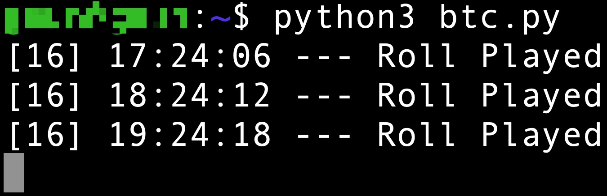

# Freebitco.in AutoRoll Bot

This bot communicates with freebitco.in website through GET and POST requests, and claims the free BTC offered by the website every hour. It uses my account cookies to avoid logging in. It generates me 0.00115+ BTC for every 85 days.

<b>Features:</b>
1. Auto Roll
2. Auto Redeem points (Reward Point Bonus and Free BTC Bonus

Make sure your account doesn’t have to solve captcha for every roll. If it does, contact me for the script that can also solve the captchas.

Insert your account’s cookies in line 14. Setup a database (I used MongoDB) to get updates on your bot. I’m running this bot on an Ubuntu Server. 

Use a 256MB/512MB ram server for best investment/profit ratio. I'm using the free Azure Server credits that I redeemed by using my education email.
